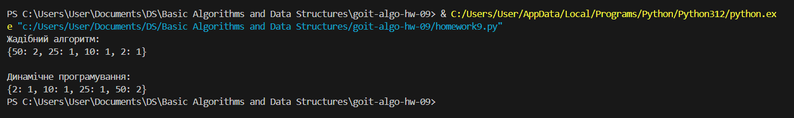
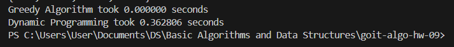

# goit-algo-hw-09

Результати порівняння часу виконання двох алгоритмів:
Жадібний алгоритм (Greedy Algorithm) виконався дуже швидко і незначно вплинув на загальний час виконання, тому час вивівся як 0.000000 seconds. Часова складність: O(n), де n — кількість номіналів монет.
Алгоритм динамічного програмування (Dynamic Programming) виконувався значно довше, і його час виконання склав приблизно 0.362806 seconds. Часова складність: O(amount * n), де amount — сума, яку потрібно видати, а n — кількість номіналів монет.
Ці результати підтверджують, що жадібний алгоритм є набагато швидшим на практиці, особливо для простих випадків із добре підібраними наборами монет, таких як [50, 25, 10, 5, 2, 1]. Однак, алгоритм динамічного програмування забезпечує оптимальне рішення для будь-якого набору монет, хоча і вимагає більше часу на виконання, особливо для великих сум.

Порівняння ефективності за умови великих сум:
- Жадібний підхід дуже ефективний для великих сум, особливо коли набір монет забезпечує оптимальне рішення. Наприклад, для стандартного набору монет [50, 25, 10, 5, 2, 1], жадібний алгоритм завжди знайде мінімальну кількість монет, необхідну для будь-якої суми. В умовах, де великий набір монет може включати номінали, які не можуть утворити оптимальне рішення (наприклад, якщо доступні лише монети 1, 3, і 4), жадібний алгоритм може не знайти мінімальне рішення. Проте для стандартного набору монет він виконується швидко, оскільки кількість ітерацій зазвичай мала.
- Алгоритм динамічного програмування завжди знаходить мінімальну кількість монет для будь-якої суми, незалежно від набору монет. Це досягається шляхом розрахунку мінімального числа монет для кожної проміжної суми до досягнення кінцевої суми. Однак часова складність цього підходу залежить від суми, що обробляється, та кількості номіналів монет. Для великих сум, коли потрібно обчислити оптимальне рішення для кожної проміжної суми, динамічне програмування може бути повільнішим, що видно з тестування.

Загалом жадібний алгоритм ефективний у ситуаціях, коли набір монет "гармонійний", тобто дозволяє розділити будь-яку суму на оптимальні частини. У цьому випадку жадібний алгоритм працює швидко і без потреби в складних обчисленнях. Він підходить для касових систем і простих випадків, де важливий швидкий розрахунок, а набір монет забезпечує правильне рішення.
Натомість, алгоритм динамічного програмування більш підходить для ситуацій, коли набір монет є "негармонійним" і жадібний підхід не може гарантувати оптимального рішення.
Наприклад, якщо набір монет складається з номіналів [1, 3, 4], для суми 6 жадібний алгоритм може обрати [4, 1, 1] замість оптимального [3, 3]. У таких випадках динамічне програмування завжди знайде найменшу кількість монет. Однак цей алгоритм є більш затратним за часом і може бути повільнішим для великих сум, оскільки потребує обчислення можливих рішень для кожної суми від 1 до кінцевої.
Отже, жадібний алгоритм є кращим вибором для більшості стандартних касових систем, де набори монет дозволяють отримувати оптимальні рішення швидко і без зайвих обчислень.
Алгоритм динамічного програмування забезпечує гарантоване оптимальне рішення, але є повільнішим і вимагає більше ресурсів для великих сум. Він є найкращим варіантом, коли набір монет не забезпечує оптимальні рішення через жадібний підхід або коли точність важливіша за швидкість.

